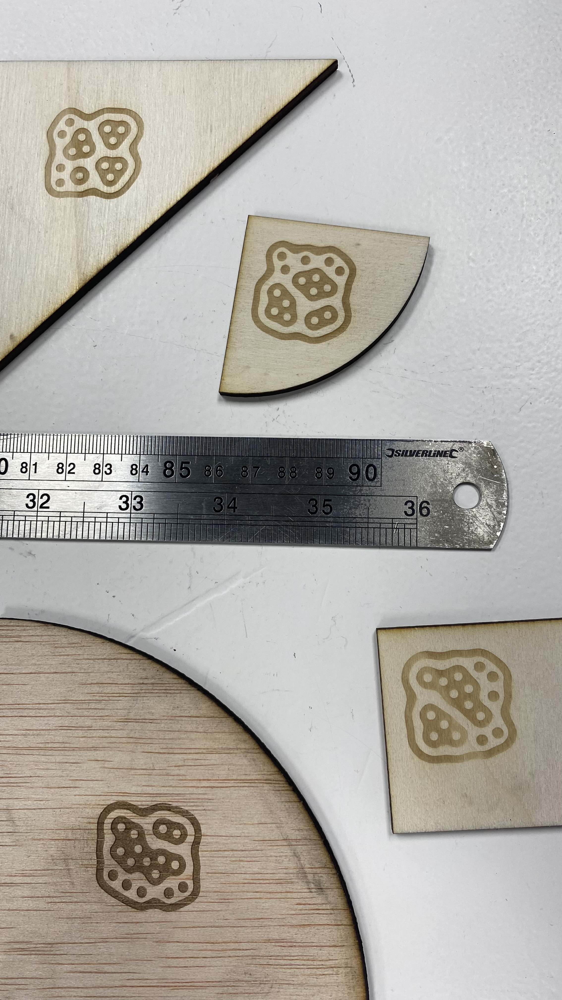
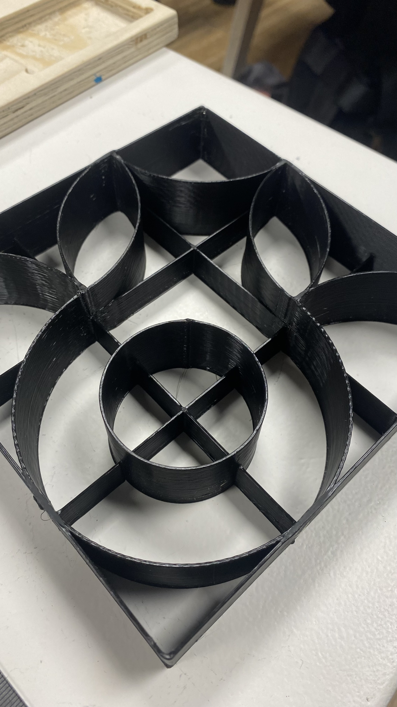

# digitaltiles
A DIY ToolKit to design and build tiles through a process that combines physical interaction and digitalisation.

---
title: MDEF 22/23 - Digital Tiles
---

###### tags: `MDEF` `Fab Lab Barcelona`

Challenge III: Digital Tiles
==========================================
Caglar / Ahmed / Marc

**A DIY ToolKit to design and build tiles through a process that combines physical interaction and digitalisation.**

"Playing in the physical and converting it to the digital"

1. [**Project Alignment**](#1-Project-alignment)
2. [**Project Development**](#2-Project-development)
3. [**Final Product**](#3-Rethink-and-reconnect)

## #1 Project Alignment

We started sharing our interests and what fields we wanted to investigate to be able to implement them to our interventions. This three circles show the intersection between our main interests.

We decided to continue the [first Challenge](https://github.com/paresmarc/tiledeco) and develop iterations to improve it and make it a more automated process.

## #2 Project Development

Firstly, we talked on 3D and 2D options and then we decided to focus on 2D option. Digital Tiles is a process to design tile paterns while playing with physical shapes. Then, generating a vectorised file you can 3D print a mould for hydraulic press production process to produce tiles in a easy and personal way.

**Design Process**
1. Open CV (Python)
2. Edge detection digitalisation
3. Vectorisation
4. Magnetic Shapes and Grid
5. Mould shape 3D printing
6. Hydraulic press
7. Tile production
8. Building pattern

## As a group we decided to develop an interface for our tile-deco and pixel-cube  projects ( maybe a website) in order to eliminate the use of grasshopper apps  and firefly plugin and make the process more accessible and easier if possible. Briefly, our main goal is to support the makers and crafts, and encourage them to use digital fabrication tools.

We agreed on using OPENCV shape detector. But, in order to use OPENCV we need PHYTON, ANACONDA and VISUAL STUDIO too. Firstly, we set the anaconda and phyton and opencv. Then we found a code for shape recognition-detection especially for “circle” from an image. We tested that through the anaconda and of course code had some problems and we asked from CHATGPT to fix the code. More or less the code works through the image but we needed to calibrate the parameters in order to get more accurate results. 

During the second day we continued to work on shape detection code. After detecting the circles on the still images we tried to configure the code for squares, rectangle, triangle, semi/quarter circles. We used edge detection and tried to convert them to defined geometric shapes, but we had problems with some undefined ones as lemon shape or croissant shape. So, in order to solve this we worked on polygon contouring but it did not ended up with smooth curves. Then, Pietro joined to support us for using phyton libraries. 

## Open CV and Python

Testing with Shape Detection

Circle detection

Shape detection and recognition

Scanned shapes with Open CV

After some discussions, we decided to use QR code detection in opencv libraries for assigned geometric shapes as we did with the fiducials on Grasshopper-firefly application model during the Challenge-No2 and we wanted to combine that with Three JS Interactive Voxel Painter project as a grid base. We spent some hours on this approach. Finally, we decided that would take months to finalize the work. 

We went back to the basic idea to detect the edges of the each geometric shapes on the grid that we designed and decided to eliminate the shades and work on lighting in order to get the best results with this basic and simple method which can be done on OpenCv and Python.

## Improving the Grasshopper grid System

Cutting shapes with Fiducial IDs

Fiducial Codes on Shapes

Shape with magnets

## Grid

Gluing base grid

Grid with shapes

Grasshopper + Grid Shapes

## Hydraulic Tile mould

Example of the Hydraulic process

Slicing shape mould

Printing with 1mm nozzle

Finished mould with grid support

Building the frame (CNC)

System for hydraulic press

